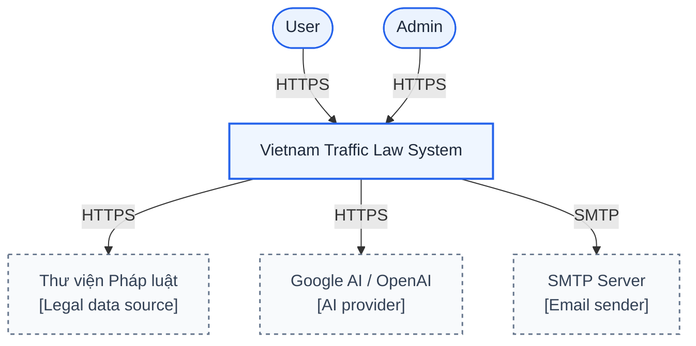
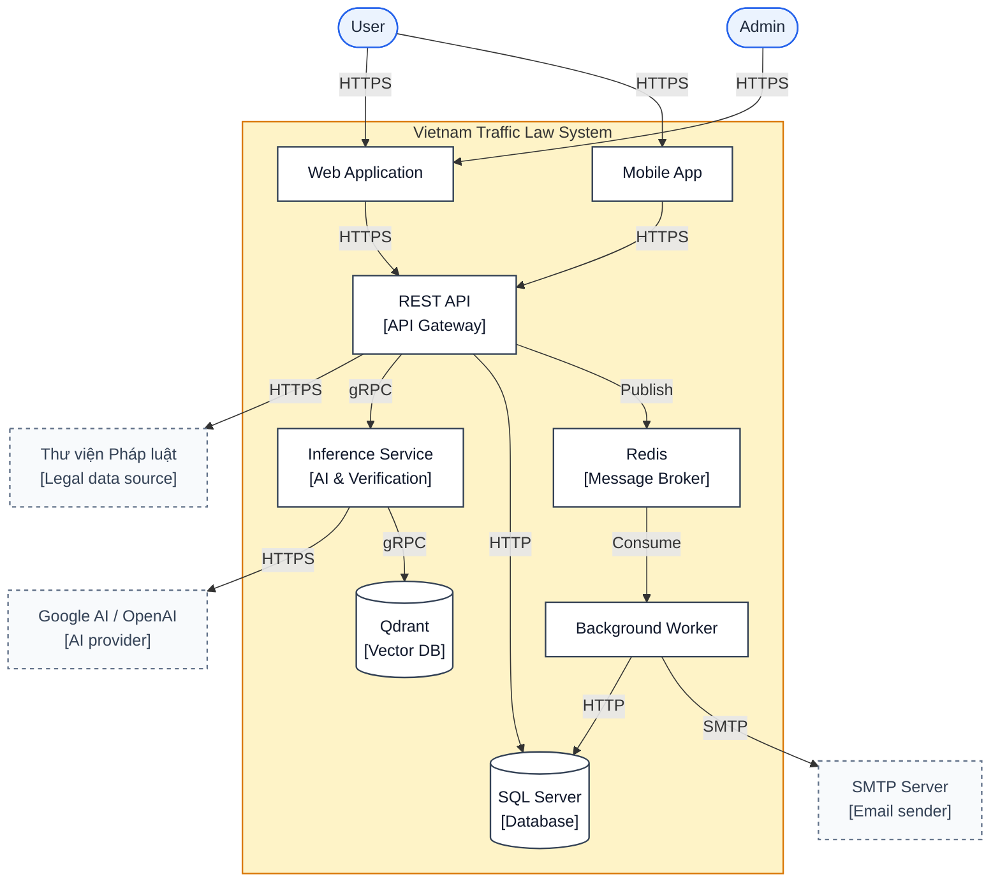
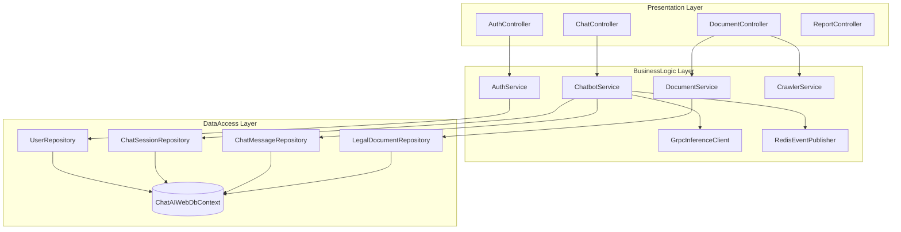
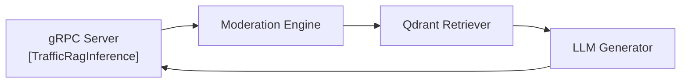
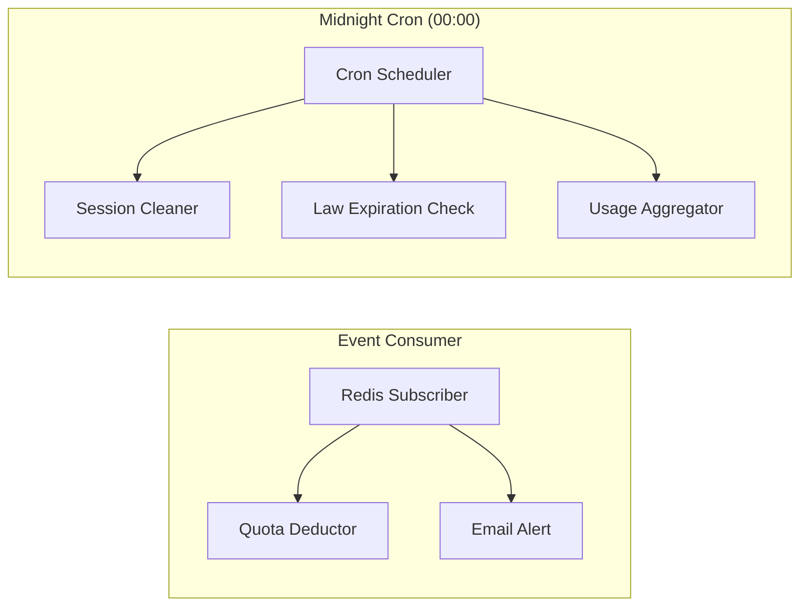
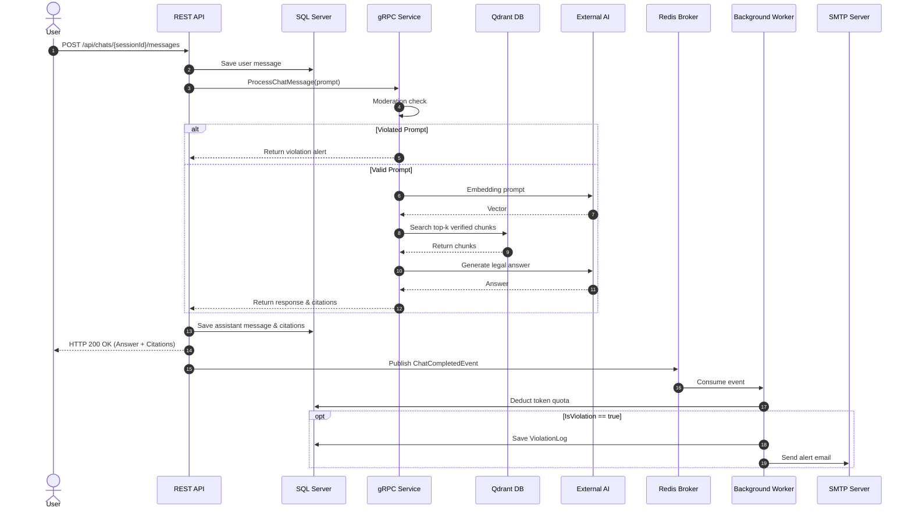
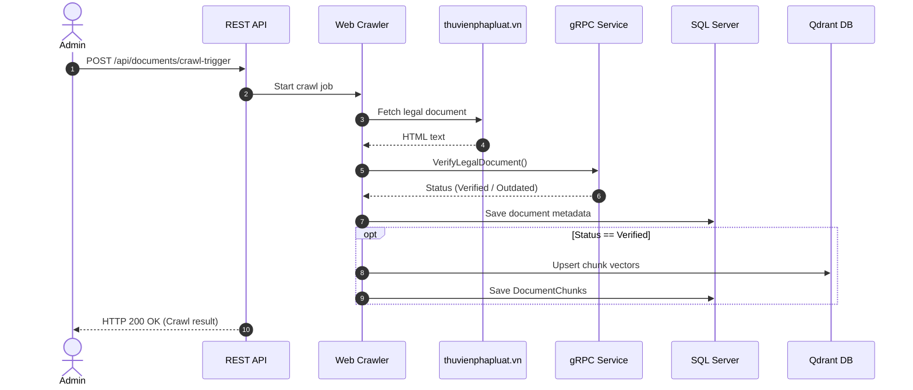
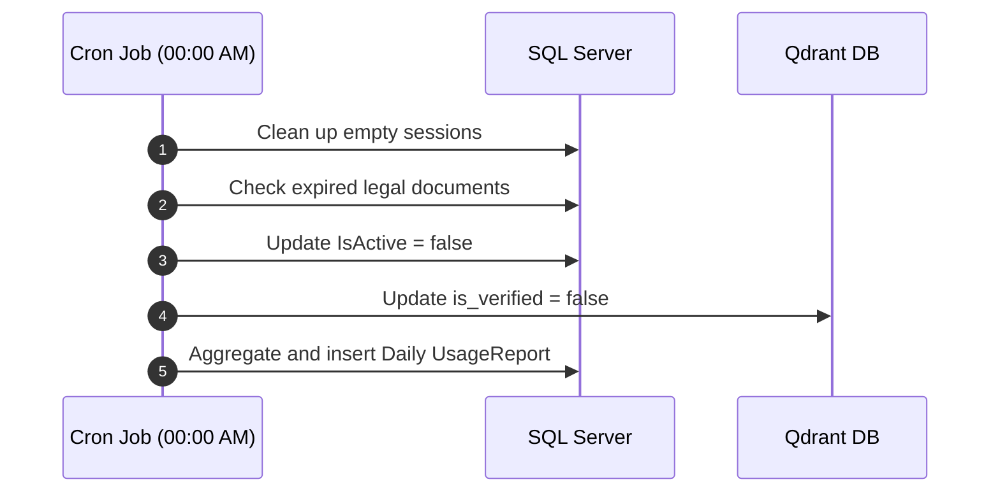
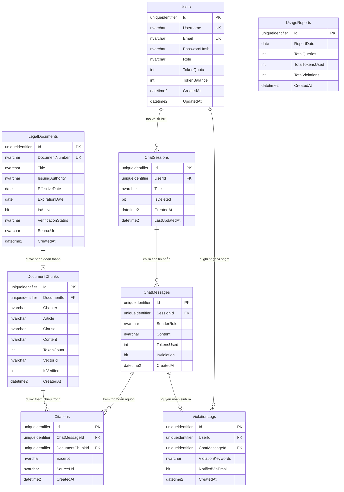
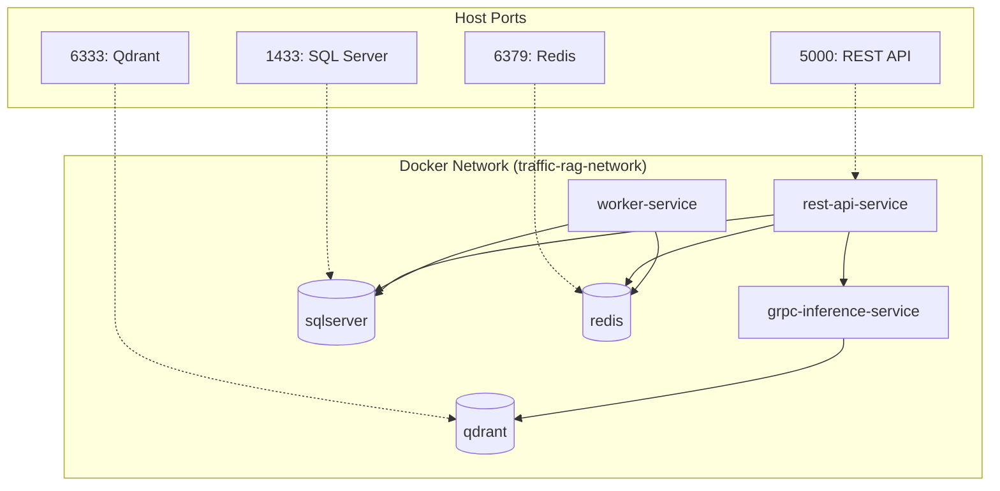

# TÀI LIỆU THIẾT KẾ KIẾN TRÚC HỆ THỐNG (ARCHITECTURE.MD)
## VIETNAM TRAFFIC LAW ADVANCED RAG SYSTEM
### Đồ án môn học: PRN232 - Distributed Applications (.NET 8 & AI Microservices)

---

## 1. TỔNG QUAN HỆ THỐNG (SYSTEM OVERVIEW)

### 1.1. Bối cảnh & Mục tiêu
Pháp luật Giao thông Đường bộ Việt Nam được quy định phân tán qua nhiều văn bản quy phạm pháp luật (Luật Giao thông Đường bộ, Nghị định 100/2019/NĐ-CP, Nghị định 123/2021/NĐ-CP, Nghị định 168/2024/NĐ-CP và các Thông tư liên quan). Điểm khó khăn lớn nhất đối với người dân và sinh viên là:
- Các văn bản thường xuyên được sửa đổi, bổ sung, hủy bỏ từng phần hoặc thay thế.
- Người dùng tra cứu thủ công dễ dẫn chiếu nhầm các điều khoản đã hết hiệu lực thi hành.
- Các mô hình AI thông thường (Zero-shot LLM) có xu hướng "bịa đặt" (hallucination) và không có khả năng tự động kiểm tra tính hiệu lực của luật hiện hành tại thời điểm truy vấn.

**Vietnam Traffic Law Advanced RAG System** là một hệ thống phân tán đa dịch vụ (Distributed Microservices System) được xây dựng trên nền tảng **.NET 8 Ecosystem**, kết hợp **Advanced RAG (Retrieval-Augmented Generation)** và **Verification Engine** nhằm đảm bảo:
1. Chỉ trích xuất và tham chiếu từ các điều khoản **đang còn hiệu lực (Verified)**.
2. Trích dẫn đầy đủ căn cứ pháp lý (Điều, Khoản, Tên văn bản, Trích dẫn trực tiếp từ Thư viện Pháp luật).
3. Đảm bảo hiệu năng cao, phân tách tác vụ nặng (kiểm duyệt, sinh văn bản, trừ quota, cảnh báo email) qua gRPC, Message Broker và Background Worker.

---

### 1.2. Các Actor trong Hệ thống

| Actor | Loại | Vai trò & Trách nhiệm chính |
| :--- | :--- | :--- |
| **Sinh viên / Người dùng (User)** | Con người (End-user) | Đăng ký, đăng nhập (JWT), tạo phiên chat, đặt câu hỏi pháp lý giao thông, nhận câu trả lời kèm trích dẫn, theo dõi hạn ngạch token cá nhân và tra cứu văn bản luật. |
| **Quản trị viên (Admin)** | Con người (Operator) | Kích hoạt crawl dữ liệu từ Thư viện Pháp luật, kích hoạt quy trình tái thẩm định hiệu lực văn bản (Verification), xem báo cáo tổng hợp hệ thống (Usage Reports), quản lý người dùng và vi phạm. |
| **Background Worker Service** | Hệ thống (Background Consumer) | Lắng nghe sự kiện bất đồng bộ qua Message Broker (Redis Pub/Sub), thực hiện trừ hạn ngạch token, ghi nhật ký vi phạm (`ViolationLogs`), gửi email cảnh báo tự động qua MailKit/SMTP. |
| **Scheduled Cron Engine** | Hệ thống (Scheduled Job) | Thực thi tự động lúc `00:00:00` hàng ngày: dọn dẹp phiên chat nháp, kiểm tra các văn bản đến hạn hết hiệu lực (`ExpirationDate`), tổng hợp báo cáo ngày vào bảng `UsageReports`. |
| **Thư viện Pháp luật (`thuvienphapluat.vn`)** | Hệ thống bên ngoài (External) | Nguồn dữ liệu luật giao thông chính thống để hệ thống cào dữ liệu và đối soát hiệu lực. |
| **LLM & Embedding Provider** | Dịch vụ AI bên ngoài (External) | OpenAI (text-embedding-3-small, GPT-4o-mini) hoặc Google Gemini phục vụ sinh vector ngữ nghĩa và sinh câu trả lời RAG. |
| **SMTP Mail Server** | Dịch vụ ngoài (External) | Cung cấp hạ tầng gửi email cảnh báo người dùng khi vi phạm chính sách kiểm duyệt. |

---

## 2. KIẾN TRÚC HỆ THỐNG C4 (C4 ARCHITECTURE MODEL)

Mô hình C4 thể hiện kiến trúc hệ thống từ mức tổng quan đến chi tiết các thành phần.

### 2.1. C0: System Context Diagram (Mức Ngữ cảnh)



---

### 2.2. C1: Container Diagram (Mức Thùng chứa / Dịch vụ)



---

### 2.3. C2: Component Diagram (Mức Thành phần chi tiết)

#### A. Các thành phần bên trong REST API Service (Presentation & Business Layers)
Tuân thủ nghiêm ngặt **3-Layer Architecture** theo quy định `AGENTS.md`:



#### B. Các thành phần bên trong gRPC AI & Verification Service



#### C. Các thành phần bên trong Worker Service (Background & Cron)



---

## 3. LUỒNG NGHIỆP VỤ HỆ THỐNG (END-TO-END WORKFLOWS)

### 3.1. Luồng Hỏi đáp Pháp lý & RAG Real-time (Chat & Advanced RAG Flow)



---

### 3.2. Luồng Cào dữ liệu & Xác thực hiệu lực Luật (Crawl & Verification Flow)



---

### 3.3. Luồng Tác vụ định kỳ hằng đêm (Midnight Cron Job Flow)



---

## 4. THIẾT KẾ CƠ SỞ DỮ LIỆU CHI TIẾT (PHYSICAL DATABASE SCHEMA)

Hệ thống sử dụng cơ sở dữ liệu quan hệ **SQL Server 2022** (`ChatAIWebDb`). 

### 4.1. Entity-Relationship Diagram (ERD)



---

### 4.2. Đặc tả Chi tiết các Bảng Dữ liệu (Physical Schema Tables)

#### Bảng 1: `Users` (Quản lý tài khoản & hạn ngạch token)
Lưu trữ thông tin người dùng, mật khẩu băm và hạn ngạch token để Background Worker quản lý trừ dần.

| Tên cột | Kiểu dữ liệu | Nullable | Khóa / Ràng buộc | Mô tả |
| :--- | :--- | :---: | :--- | :--- |
| `Id` | `uniqueidentifier` | NO | PK, Default `NEWSEQUENTIALID()` | Khóa chính |
| `Username` | `nvarchar(100)` | NO | Unique Index | Tên tài khoản đăng nhập |
| `Email` | `nvarchar(256)` | NO | Unique Index | Địa chỉ email để nhận thông báo cảnh báo |
| `PasswordHash` | `nvarchar(MAX)` | NO | - | Mật khẩu mã hóa bằng BCrypt / PBKDF2 |
| `Role` | `nvarchar(50)` | NO | Default `'User'` | Vai trò: `Admin`, `User` |
| `TokenQuota` | `int` | NO | Default `10000` | Tổng hạn ngạch token được cấp |
| `TokenBalance` | `int` | NO | Default `10000`, Check `>= 0` | Số dư token khả dụng còn lại |
| `CreatedAt` | `datetime2(7)` | NO | Default `SYSUTCDATETIME()` | Thời điểm tạo tài khoản |
| `UpdatedAt` | `datetime2(7)` | NO | Default `SYSUTCDATETIME()` | Thời điểm cập nhật |

#### Bảng 2: `LegalDocuments` (Danh mục Văn bản Quy phạm Pháp luật Giao thông)
Lưu trữ thông tin các văn bản quy phạm pháp luật (Luật, Nghị định, Thông tư) được cào từ Thư viện Pháp luật kèm trạng thái hiệu lực.

| Tên cột | Kiểu dữ liệu | Nullable | Khóa / Ràng buộc | Mô tả |
| :--- | :--- | :---: | :--- | :--- |
| `Id` | `uniqueidentifier` | NO | PK, Default `NEWSEQUENTIALID()` | Khóa chính |
| `DocumentNumber` | `nvarchar(100)` | NO | Unique Index | Số hiệu văn bản (vd: `100/2019/NĐ-CP`, `123/2021/NĐ-CP`) |
| `Title` | `nvarchar(500)` | NO | - | Tiêu đề đầy đủ của văn bản |
| `IssuingAuthority`| `nvarchar(255)` | YES | - | Cơ quan ban hành (vd: Chính phủ, Bộ GTVT) |
| `EffectiveDate` | `date` | NO | - | Ngày bắt đầu có hiệu lực thi hành |
| `ExpirationDate` | `date` | YES | - | Ngày hết hiệu lực thi hành (NULL nếu chưa xác định) |
| `IsActive` | `bit` | NO | Default `1` | `1` = Đang áp dụng, `0` = Đã hết hiệu lực |
| `VerificationStatus` | `nvarchar(50)` | NO | Default `'Pending'` | Trạng thái xác thực: `Pending`, `Verified`, `Outdated` |
| `SourceUrl` | `nvarchar(1000)` | YES | - | Đường link gốc tại `thuvienphapluat.vn` |
| `CreatedAt` | `datetime2(7)` | NO | Default `SYSUTCDATETIME()` | Thời điểm lưu văn bản |

#### Bảng 3: `DocumentChunks` (Các đoạn phân rã theo Điều, Khoản phục vụ Vector Search)
Mỗi văn bản được phân nhỏ theo từng Chương, Điều, Khoản để embedding và nạp vào Qdrant.

| Tên cột | Kiểu dữ liệu | Nullable | Khóa / Ràng buộc | Mô tả |
| :--- | :--- | :---: | :--- | :--- |
| `Id` | `uniqueidentifier` | NO | PK, Default `NEWSEQUENTIALID()` | Khóa chính |
| `DocumentId` | `uniqueidentifier` | NO | FK -> `LegalDocuments(Id)` ON DELETE CASCADE | Văn bản gốc chứa điều khoản |
| `Chapter` | `nvarchar(100)` | YES | - | Tên/Số thứ tự Chương (vd: Chương II) |
| `Article` | `nvarchar(100)` | NO | - | Tên/Số Điều (vd: Điều 5) |
| `Clause` | `nvarchar(255)` | YES | - | Khoản/Điểm cụ thể (vd: Khoản 1 Điểm a) |
| `Content` | `nvarchar(MAX)` | NO | - | Toàn văn nội dung quy định của điều/khoản |
| `TokenCount` | `int` | NO | Default `0` | Số lượng token ước tính của chunk |
| `VectorId` | `nvarchar(100)` | YES | Index | ID điểm vector tương ứng trong Qdrant DB |
| `IsVerified` | `bit` | NO | Default `1` | Chỉ các chunk `IsVerified = 1` mới được RAG truy xuất |
| `CreatedAt` | `datetime2(7)` | NO | Default `SYSUTCDATETIME()` | Ngày tạo chunk |

#### Bảng 4: `ChatSessions` (Phiên làm việc hỏi đáp AI)
Quản lý danh sách các cuộc hội thoại của từng người dùng.

| Tên cột | Kiểu dữ liệu | Nullable | Khóa / Ràng buộc | Mô tả |
| :--- | :--- | :---: | :--- | :--- |
| `Id` | `uniqueidentifier` | NO | PK, Default `NEWSEQUENTIALID()` | Khóa chính phiên chat |
| `UserId` | `uniqueidentifier` | NO | FK -> `Users(Id)` ON DELETE CASCADE | Người dùng sở hữu phiên chat |
| `Title` | `nvarchar(255)` | NO | Default `'Cuộc trò chuyện mới'` | Tiêu đề phiên hỏi đáp |
| `IsDeleted` | `bit` | NO | Default `0` | Cờ xóa mềm (Soft delete) |
| `CreatedAt` | `datetime2(7)` | NO | Default `SYSUTCDATETIME()` | Thời điểm tạo phiên |
| `LastUpdatedAt`| `datetime2(7)` | NO | Default `SYSUTCDATETIME()` | Thời điểm cập nhật tin nhắn cuối cùng |

#### Bảng 5: `ChatMessages` (Lịch sử Tin nhắn trong Phiên)
Lưu toàn bộ tin nhắn hỏi của User và phản hồi trả về từ AI.

| Tên cột | Kiểu dữ liệu | Nullable | Khóa / Ràng buộc | Mô tả |
| :--- | :--- | :---: | :--- | :--- |
| `Id` | `uniqueidentifier` | NO | PK, Default `NEWSEQUENTIALID()` | Khóa chính tin nhắn |
| `SessionId` | `uniqueidentifier` | NO | FK -> `ChatSessions(Id)` ON DELETE CASCADE | Thuộc phiên chat nào |
| `SenderRole` | `nvarchar(20)` | NO | Check `IN ('User', 'Assistant')` | Vai trò gửi tin nhắn |
| `Content` | `nvarchar(MAX)` | NO | - | Nội dung tin nhắn (câu hỏi hoặc câu trả lời) |
| `TokensUsed` | `int` | NO | Default `0` | Số token tiêu tốn cho câu hỏi/trả lời này |
| `IsViolation` | `bit` | NO | Default `0` | Cờ đánh dấu câu hỏi có chứa từ khóa vi phạm |
| `CreatedAt` | `datetime2(7)` | NO | Default `SYSUTCDATETIME()` | Thời điểm gửi tin nhắn |

#### Bảng 6: `Citations` (Nguồn trích dẫn pháp lý kèm theo câu trả lời)
Mỗi câu trả lời của trợ lý AI có thể dẫn xuất từ một hoặc nhiều điều khoản luật cụ thể.

| Tên cột | Kiểu dữ liệu | Nullable | Khóa / Ràng buộc | Mô tả |
| :--- | :--- | :---: | :--- | :--- |
| `Id` | `uniqueidentifier` | NO | PK, Default `NEWSEQUENTIALID()` | Khóa chính |
| `ChatMessageId`| `uniqueidentifier` | NO | FK -> `ChatMessages(Id)` ON DELETE CASCADE | Tin nhắn trả lời của AI |
| `DocumentChunkId`| `uniqueidentifier` | NO | FK -> `DocumentChunks(Id)` | Đoạn chunk điều khoản được tham chiếu |
| `Excerpt` | `nvarchar(MAX)` | YES | - | Đoạn trích dẫn nội dung nguyên văn |
| `SourceUrl` | `nvarchar(1000)`| YES | - | Đường dẫn link nguồn tra cứu tại Thư viện Pháp luật |
| `CreatedAt` | `datetime2(7)` | NO | Default `SYSUTCDATETIME()` | Thời điểm ghi nhận trích dẫn |

#### Bảng 7: `ViolationLogs` (Nhật ký vi phạm quy định kiểm duyệt)
Lưu lại các câu hỏi chứa nội dung bạo lực, xúc phạm, chống phá được phát hiện bởi Moderation Engine.

| Tên cột | Kiểu dữ liệu | Nullable | Khóa / Ràng buộc | Mô tả |
| :--- | :--- | :---: | :--- | :--- |
| `Id` | `uniqueidentifier` | NO | PK, Default `NEWSEQUENTIALID()` | Khóa chính |
| `UserId` | `uniqueidentifier` | NO | FK -> `Users(Id)` | Tài khoản vi phạm |
| `ChatMessageId`| `uniqueidentifier` | YES | FK -> `ChatMessages(Id)` ON DELETE SET NULL | Tin nhắn vi phạm (nếu có) |
| `ViolationKeywords` | `nvarchar(500)` | NO | - | Danh sách từ khóa độc hại phát hiện |
| `NotifiedViaEmail` | `bit` | NO | Default `0` | Trạng thái đã gửi email cảnh báo hay chưa |
| `CreatedAt` | `datetime2(7)` | NO | Default `SYSUTCDATETIME()` | Thời điểm phát hiện vi phạm |

#### Bảng 8: `UsageReports` (Báo cáo Thống kê Định kỳ Ngày)
Bảng tổng hợp độc lập được tính toán bởi Midnight Cron Job phục vụ Dashboard quản trị.

| Tên cột | Kiểu dữ liệu | Nullable | Khóa / Ràng buộc | Mô tả |
| :--- | :--- | :---: | :--- | :--- |
| `Id` | `uniqueidentifier` | NO | PK, Default `NEWSEQUENTIALID()` | Khóa chính |
| `ReportDate` | `date` | NO | Unique Index | Ngày thống kê |
| `TotalQueries` | `int` | NO | Default `0` | Tổng số câu hỏi đặt ra trong ngày |
| `TotalTokensUsed`| `int` | NO | Default `0` | Tổng số lượng token tiêu thụ |
| `TotalViolations`| `int` | NO | Default `0` | Tổng số lượt phát hiện vi phạm |
| `CreatedAt` | `datetime2(7)` | NO | Default `SYSUTCDATETIME()` | Thời điểm chạy tổng hợp |

---

### 4.3. Các Chỉ mục Tối ưu Hiệu năng (Database Indexes)

Để đáp ứng yêu cầu phản hồi < 3 giây và xử lý hàng triệu bản ghi tin nhắn và trích dẫn, các chỉ mục sau được thiết lập bắt buộc:

1. **`IX_ChatMessages_SessionId_CreatedAt`**:
   - Bảng: `ChatMessages (SessionId ASC, CreatedAt ASC)`
   - Mục đích: Tải lịch sử tin nhắn trong phiên chat với tốc độ tức thì, tối ưu phân trang lịch sử.
2. **`IX_ChatSessions_UserId_IsDeleted`**:
   - Bảng: `ChatSessions (UserId ASC, IsDeleted ASC)`
   - Mục đích: Lấy nhanh danh sách các phiên trò chuyện còn hiệu lực của người dùng ở sidebar.
3. **`IX_LegalDocuments_IsActive_ExpirationDate`**:
   - Bảng: `LegalDocuments (IsActive ASC, ExpirationDate ASC)`
   - Mục đích: Tối ưu cho Cron Job nửa đêm quét các văn bản đến hạn hết hiệu lực.
4. **`IX_DocumentChunks_DocumentId_IsVerified`**:
   - Bảng: `DocumentChunks (DocumentId ASC, IsVerified ASC)`
   - Mục đích: Truy vấn nhanh danh sách các chunk đã xác thực của một văn bản khi cập nhật hoặc xoá.
5. **`IX_Citations_ChatMessageId`**:
   - Bảng: `Citations (ChatMessageId ASC)`
   - Mục đích: Tải nhanh danh sách trích dẫn đính kèm theo từng tin nhắn trả lời của AI.
6. **`IX_ViolationLogs_UserId_CreatedAt`**:
   - Bảng: `ViolationLogs (UserId ASC, CreatedAt DESC)`
   - Mục đích: Giúp Quản trị viên tra cứu các vi phạm gần nhất của từng người dùng.

---

## 5. THIẾT KẾ GIAO THỨC LIÊN DỊCH VỤ (INTER-SERVICE PROTOCOLS)

### 5.1. Đặc tả gRPC Service (`chat_inference.proto`)

Dịch vụ gRPC đóng vai trò là "bộ não" AI độc lập, giao tiếp với REST API Gateway qua Protobuf nhị phân hiệu năng cao.

```protobuf
syntax = "proto3";

package traffic_rag;

option csharp_namespace = "BusinessLogic.Grpc";

// Dịch vụ suy luận AI và xác thực dữ liệu pháp lý giao thông
service TrafficRagInference {
  // Suy luận câu trả lời RAG từ câu hỏi của người dùng
  rpc ProcessChatMessage (ChatInferenceRequest) returns (ChatInferenceResponse);
  
  // Xác thực văn bản luật (kiểm tra tính hiệu lực, mâu thuẫn/sửa đổi)
  rpc VerifyLegalDocument (VerificationRequest) returns (VerificationResponse);
}

// Request gửi từ REST API Gateway
message ChatInferenceRequest {
  string user_id = 1;
  string session_id = 2;
  string prompt = 3;
}

// Dữ liệu nguồn trích dẫn
message CitationDto {
  string document_title = 1;
  string article_number = 2;
  string clause_number = 3;
  string source_url = 4;
  string excerpt = 5;
}

// Response trả về cho REST API Gateway
message ChatInferenceResponse {
  string response_text = 1;
  int32 tokens_used = 2;
  bool is_violation = 3;
  repeated string violation_keywords = 4;
  repeated CitationDto citations = 5;
  bool data_verified = 6;
}

// Request xác thực văn bản luật
message VerificationRequest {
  string document_number = 1;
  string title = 2;
  string issuing_authority = 3;
  string effective_date = 4;
  string expiration_date = 5;
  string content = 6;
}

// Kết quả xác thực văn bản luật
message VerificationResponse {
  string document_number = 1;
  bool is_valid = 2;
  string verification_status = 3; // "Verified", "Pending", "Outdated"
  string notes = 4;
}
```

---

### 5.2. Đặc tả Message Broker Event (`ChatCompletedEvent`)

Sự kiện được phát lên Redis Pub/Sub trên kênh `chat-completed-events`:

```json
{
  "EventId": "9b1deb4d-3b7d-4bad-9bdd-2b0d7b3dcb6d",
  "EventType": "ChatCompletedEvent",
  "UserId": "3fa85f64-5717-4562-b3fc-2c963f66afa6",
  "SessionId": "7ca53e12-4217-4952-a1fb-1c963f77dfb8",
  "Prompt": "Vượt đèn đỏ xe máy bị phạt bao nhiêu tiền theo nghị định mới nhất?",
  "Response": "Theo quy định tại Điểm e Khoản 4 Điều 6 Nghị định 100/2019/NĐ-CP (được sửa đổi bởi Nghị định 123/2021/NĐ-CP), người điều khiển xe mô tô, xe gắn máy có hành vi không chấp hành hiệu lệnh của đèn tín hiệu giao thông (vượt đèn đỏ) sẽ bị xử phạt từ 800.000 đồng đến 1.000.000 đồng...",
  "TokensUsed": 485,
  "IsViolation": false,
  "ViolationKeywords": [],
  "Timestamp": "2026-09-24T14:30:00Z"
}
```

---

## 6. THIẾT KẾ TRIỂN KHAI DOCKER COMPOSE (CONTAINERIZATION SPEC)

Hệ thống được đóng gói hoàn chỉnh bằng `docker-compose.yml` gồm **6 container**, giao tiếp qua mạng nội bộ `traffic-rag-network`:



### Bảng cấu hình 6 Containers:

| STT | Tên Container | Base Image / Build Context | Port Expose | Dependencies (`depends_on`) | Chức năng chính |
| :---: | :--- | :--- | :--- | :--- | :--- |
| **1** | `sqlserver` | `mcr.microsoft.com/mssql/server:2022-latest` | `1433:1433` | Không | Database quan hệ `ChatAIWebDb`, lưu User, Session, Documents, Logs. |
| **2** | `qdrant` | `qdrant/qdrant:latest` | `6333:6333` | Không | Vector Database lưu trữ vector embeddings các đoạn luật giao thông. |
| **3** | `redis` | `redis:7-alpine` | `6379:6379` | Không | Message Broker truyền nhận sự kiện & caching. |
| **4** | `grpc-inference-service` | Dockerfile (Python / .NET gRPC) | `5050:5050` | `qdrant` | Xử lý kiểm duyệt từ khóa, tìm kiếm ngữ nghĩa RAG và sinh câu trả lời tiếng Việt. |
| **5** | `rest-api-service` | Dockerfile (.NET 8 SDK) | `5000:8080`, `5001:8081` | `sqlserver`, `redis`, `grpc-inference-service` | API Gateway, xác thực JWT, tiếp nhận yêu cầu từ client, publish event. |
| **6** | `worker-service` | Dockerfile (.NET 8 Worker) | Không expose | `sqlserver`, `redis` | Lắng nghe event trừ token, gửi email cảnh báo vi phạm và chạy cron job lúc 00:00. |

---

## 7. ĐỐI CHIẾU TIÊU CHÍ ĐÁNH GIÁ ĐỒ ÁN PRN232 (EVALUATION MATRIX MAPPING)

| Tiêu chí đồ án PRN232 | Trọng số | Yêu cầu môn học | Giải pháp thiết kế & Triển khai trong Hệ thống | Mức đáp ứng |
| :--- | :---: | :--- | :--- | :---: |
| **System Architecture & Design** | **20%** | Kiến trúc phân tán nhiều tầng, thiết kế chuẩn mực, tách biệt rõ ràng trách nhiệm giữa các dịch vụ. | Áp dụng Clean 3-Layer Architecture cho .NET Core kết hợp Microservices (REST API Gateway, độc lập gRPC Service, Redis Message Broker, Background Worker). Có đầy đủ C0, C1, C2 và ERD. | **100%** |
| **REST API Implementation** | **20%** | Xây dựng ít nhất 1 ASP.NET Core REST API, CRUD các thực thể chính, phân trang, lọc, sắp xếp, xác thực JWT. | 4 Controllers đầy đủ: `AuthController` (JWT/Refresh Token), `ChatController` (CRUD Sessions/Messages, phân trang), `DocumentController` (Tra cứu luật, lọc hiệu lực), `ReportController`. | **100%** |
| **Background Job** | **10%** | Xử lý tác vụ ngầm hoặc tác vụ lên lịch định kỳ (gửi email, đồng bộ dữ liệu, dọn dẹp, báo cáo). | .NET 8 Worker Service tích hợp MailKit gửi Email cảnh báo vi phạm ngay khi nhận event, và Cron Job (`0 0 * * *`) dọn session rác, quét luật hết hiệu lực, tổng hợp báo cáo ngày. | **100%** |
| **Message Broker** | **15%** | Tích hợp Redis Pub/Sub hoặc Kafka, chứng minh có Producer và Consumer. | Redis Pub/Sub với channel `chat-completed-events`. REST API là **Producer** gửi sự kiện sau mỗi lượt chat; Worker Service là **Consumer** tiêu thụ để trừ token & alert. | **100%** |
| **gRPC Service** | **15%** | Phát triển dịch vụ độc lập giao tiếp qua gRPC, tương tác giữa REST API và gRPC. | Dịch vụ gRPC độc lập với Protobuf (`chat_inference.proto`), thực hiện 2 RPCs: `ProcessChatMessage` (Moderation + RAG) và `VerifyLegalDocument` (Xác thực hiệu lực). | **100%** |
| **Docker / Cloud Deployment** | **10%** | Triển khai toàn bộ hệ thống bằng Docker Compose với tất cả các dịch vụ giao tiếp thông suốt. | File `docker-compose.yml` liên kết toàn diện 6 container: SQL Server, Qdrant, Redis, gRPC Inference, REST API Gateway, Worker Service trên cùng một bridge network. | **100%** |
| **Documentation & Presentation** | **10%** | Tài liệu đầy đủ: Kiến trúc hệ thống, hướng dẫn cài đặt, phân công thành viên, Swagger. | `ARCHITECTURE.md` (C4 & DB chi tiết), `requirement.md`, `task.md` (5 thành viên phân công đồng đều), `README.md` kèm hướng dẫn cài đặt chi tiết và tài liệu Swagger OpenAPI. | **100%** |

---

## 8. KẾT LUẬN & ĐỊNH HƯỚNG TRIỂN KHAI

Tài liệu này xác lập tiêu chuẩn kỹ thuật thống nhất cho toàn bộ 5 thành viên trong nhóm đồ án PRN232. Các bước triển khai tiếp theo tuân theo đúng phân công trong `task.md`:
1. **Bảo (Backend Core):** Khởi tạo SQL Server `ChatAIWebDb` theo đúng bảng vật lý ở mục 4, cập nhật Entities, DbContext, Repositories và triển khai `AuthController` (JWT/Refresh Token).
2. **Khôi (AI & gRPC):** Biên dịch file `chat_inference.proto`, thiết lập Qdrant collection `traffic_law_chunks`, hoàn thiện Moderation Engine và RAG Generator với Citations.
3. **Khánh (Broker & Worker):** Cấu hình Redis Pub/Sub, xây dựng .NET Worker Service để consume sự kiện, trừ token và gửi email cảnh báo qua MailKit/SMTP.
4. **Vương (Chat API & Docker):** Triển khai `ChatController`, gRPC Client kết nối sang gRPC Inference Service, viết Dockerfiles và `docker-compose.yml` cho toàn bộ 6 containers.
5. **Phúc (Document API & Crawler):** Triển khai `DocumentController`, Crawler cào văn bản từ `thuvienphapluat.vn`, tích hợp tác vụ Cron lúc 00:00 AM và hoàn thiện tài liệu thuyết trình.
