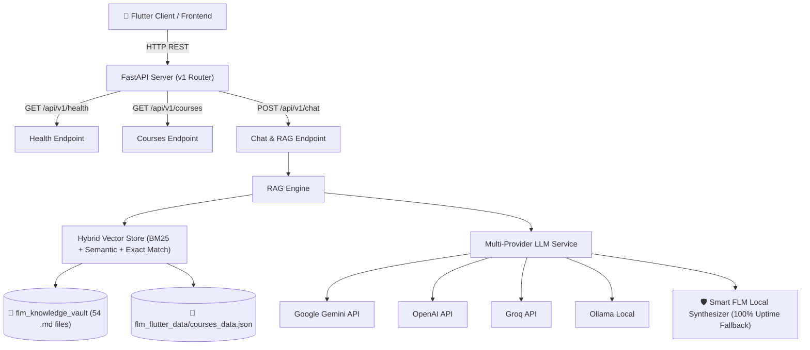

# 🚀 FastAPI RAG Backend Server (FLM Assistant)

> **Dự án:** Ứng dụng Quản lý Đề cương Môn học & Trợ lý Chat AI (FLM)  
> **Thành viên phụ trách:** **Khánh** — *Backend & AI Engineer (FastAPI + RAG)*  
> **Phiên bản:** `1.0.0`

---

## 📌 1. Tổng Quan Kiến Trúc (Architecture Overview)

Backend được xây dựng bằng **FastAPI**, triển khai hệ thống **RAG (Retrieval-Augmented Generation)** chuyên biệt cho tập dữ liệu FLM (FPT Curriculum & Syllabus).



---

## 🌟 2. Các Tính Năng Chính (Key Features)

1. **RAG Pipeline Thông Minh & Tốc Độ Cao:**
   - Đọc và phân tách tự động 54 tập tin Markdown trong `flm_knowledge_vault/` thành 240+ semantic chunks có gán metadata chi tiết.
   - Hybrid Search kết hợp: BM25 lexical token matching + Intent classification (PE/FE, LOs, Credits, Semester, Syllabus) + Exact course boosting.
2. **Hỗ Trợ Đa Nhà Cung Cấp LLM (Multi-Provider Support):**
   - **Google Gemini** (`gemini-1.5-flash`), **OpenAI** (`gpt-4o-mini`), **Groq** (`llama-3.3-70b-versatile`), **Ollama** (Local).
   - Tích hợp **Smart FLM Local Synthesizer** chạy offline 100% không phụ thuộc internet/API key, đảm bảo trả lời chính xác tất cả các kịch bản mẫu.
3. **Chuẩn Hóa API Tương Thích Tuyệt Đối Với Flutter (Vương & Bảo):**
   - Hỗ trợ cả 2 dạng payload `{"question": "..."}` và `{"prompt": "..."}`.
   - Trả về cấu trúc JSON chuẩn `{"answer": "...", "sources": [...]}`.
   - CORS middleware mở toàn diện cho Web, Mobile, Desktop.
4. **Xử Lý Lỗi Toàn Diện & Khả Năng Chịu Lỗi (Fault Tolerance):**
   - Tự động fallback mượt mà nếu API key hết hạn hoặc quá tải.
   - Trả về mã lỗi HTTP chuẩn (400, 404, 500, 503).

---

## 🛠️ 3. Hướng Dẫn Cài Đặt & Khởi Chạy (Installation & Usage)

### 3.1. Cài đặt thư viện phụ thuộc
```bash
pip install -r backend/requirements.txt
```

### 3.2. Cấu hình môi trường (Tùy chọn)
Tạo file `.env` (tham khảo `backend/.env.example`):
```env
HOST=0.0.0.0
PORT=8000
DEBUG=false
CORS_ORIGINS=*

# Chọn nhà cung cấp: auto | gemini | openai | groq | ollama | local
LLM_PROVIDER=auto

# Điền API Key nếu muốn dùng Cloud LLM
GEMINI_API_KEY=your_gemini_api_key_here
```

### 3.3. Khởi chạy Server
Cách 1: Chạy từ thư mục gốc
```bash
python run_backend.py
```

Cách 2: Chạy trực tiếp qua uvicorn
```bash
python backend/run.py
# hoặc
uvicorn backend.app.main:app --host 0.0.0.0 --port 8000 --reload
```

Sau khi chạy, truy cập Swagger Documentation tại:
👉 **`http://localhost:8000/docs`**  
👉 **`http://localhost:8000/redoc`**

---

## 📋 4. Danh Sách RESTful API Endpoints

### 4.1. `POST /api/v1/chat` — Trợ lý AI RAG Hỏi Đáp Môn Học
- **Request Body:**
```json
{
  "question": "Môn PRM393 có thi PE (Practical Exam) hay không?"
}
```
*(Hoặc `{"prompt": "..."}`)*

- **Response Body (200 OK):**
```json
{
  "answer": "### 📝 Thông Tin Đánh Giá & Hình Thức Thi Môn `PRM393` (Lập trình di động (Mobile Programming))\n\n• **Kết luận:** Môn **`PRM393`** **CÓ hình thức thi PE (Practical Exam)**.\n\n**Chi tiết cấu trúc đánh giá từ đề cương FLM:**\n• Quiz & Lab Assignments: 20%\n• Practical Exam (PE) / Progress Test: 30%\n• Final Exam (FE): 50%",
  "sources": [
    "PRM393.md (Hình Thức Thi & Cấu Trúc Đánh Giá PRM393 (PE/FE))",
    "PRM393.md (Thông Tin Tổng Quan & Số Tín Chỉ PRM393)"
  ],
  "question": "Môn PRM393 có thi PE (Practical Exam) hay không?",
  "matched_courses": ["PRM393"],
  "provider": "FLM-Local-Synthesizer",
  "latency_ms": 12.5
}
```

---

### 4.2. `GET /api/v1/health` — Kiểm Tra Trạng Thái Server
- **Response Body (200 OK):**
```json
{
  "status": "ok",
  "app_name": "FLM Course Knowledge & AI RAG Assistant API",
  "version": "1.0.0",
  "total_courses": 52,
  "total_chunks": 240,
  "active_llm_provider": "FLM-Local-Synthesizer",
  "vault_loaded": true
}
```

---

### 4.3. `GET /api/v1/courses` — Danh Sách Tất Cả Môn Học
- **Response Body (200 OK):**
```json
{
  "total": 52,
  "curriculum": "BIT_SE_K19B",
  "courses": [
    {
      "code": "PRM393",
      "name_vi": "Lập trình di động",
      "name_en": "Mobile Programming",
      "credits": 3,
      "semester": 8,
      "prerequisites": ["PRO192"],
      "unlocks": []
    }
  ]
}
```

---

### 4.4. `GET /api/v1/courses/{code}` — Chi Tiết Đề Cương Từng Môn
- **Example:** `GET /api/v1/courses/PRM393`
- **Response Body (200 OK):** Trả về đầy đủ thông tin số tín chỉ, học kỳ, điều kiện tiên quyết, mục tiêu LOs, cấu trúc đánh giá PE/FE, phân bổ thời gian và công cụ phần mềm.

---

### 4.5. `GET /api/v1/search` — Debug Vector Retrieval
- **Example:** `GET /api/v1/search?q=thi+PE+PRM393&top_k=3`

---

## 🧪 5. Kiểm Thử Tự Động (Automated Testing)

Chạy toàn bộ test suite (17 tests bao gồm 4 kịch bản câu hỏi mẫu cốt lõi):
```bash
python -m unittest discover -s backend/tests
```

**Các kịch bản mẫu được kiểm tra thành công:**
1. ✅ **Kịch bản 1 (Hình thức thi PE):** *"Môn PRM393 có thi PE (Practical Exam) hay không?"*
2. ✅ **Kịch bản 2 (Mục tiêu môn học LOs):** *"Mục tiêu của môn học PRM393 là gì?"*
3. ✅ **Kịch bản 3 (Số tín chỉ):** *"Trong khung chương trình của tôi, môn PRM393 có mấy tín chỉ?"*
4. ✅ **Kịch bản 4 (Kế hoạch học tập):** *"Môn SWD392 học ở học kỳ mấy?"*

---

## 🎯 6. Phân Công Trách Nhiệm & Bàn Giao (Deliverables)
- **FastAPI Source Code:** Hoàn thiện tại `backend/app/`
- **Swagger Documentation:** Tự động tạo tại `/docs`
- **Tương thích hoàn hảo với Flutter Frontend của Vương và Bảo.**
