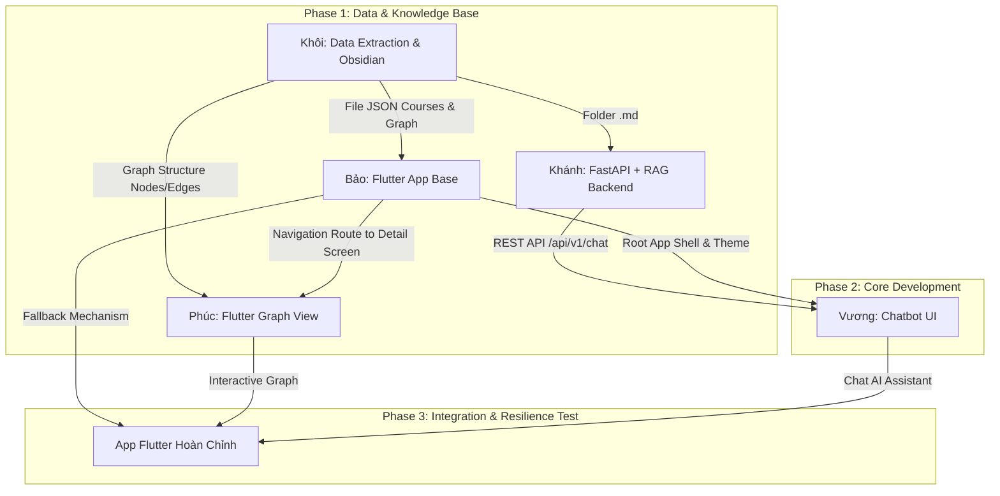

# BẢNG PHÂN CHIA NHIỆM VỤ DỰ ÁN LAB 1: HỆ THỐNG OBSIDIAN & CHAT AI FLM

> **Môn học:** PRM323  
> **Dự án:** Ứng dụng Quản lý Đề cương Môn học & Trợ lý Chat AI (FLM)  
> **Số lượng thành viên:** 5 người (*Khôi, Khánh, Bảo, Phúc, Vương*)  

---

## 📌 1. BẢNG TÓM TẮT PHÂN CHIA VAI TRÒ & SẢN PHẨM BÀN GIAO

| STT | Thành Viên | Vai Trò (Role) | Nhiệm Vụ Chính (Key Responsibilities) | Sản Phẩm Bàn Giao (Deliverables) |
|---|---|---|---|---|
| **1** | **Khôi** | **Data Lead & Knowledge Graph Architect** | - Trích xuất dữ liệu từ HTML của hệ thống FLM. - Chuyển đổi dữ liệu sang định dạng Markdown (`.md`). - Chuẩn hóa metadata & liên kết hai chiều `[[MÃ_MÔN]]`. - Tối ưu hóa sơ đồ tri thức trên **Obsidian Graph View**. | - Bộ dữ liệu `.md` đầy đủ chuẩn hóa. - File cấu trúc JSON danh sách môn & liên kết node/edge cho Flutter. |
| **2** | **Khánh** | **Backend & AI Engineer (FastAPI + RAG)** | - Xây dựng RESTful API Server bằng **FastAPI**. - Xây dựng RAG Pipeline (Vector DB + Text Splitter + Embeddings). - Tích hợp LLM trả lời chuẩn xác thông tin môn học (PE/FE, LOs, Tín chỉ, HK). | - Source code FastAPI Server. - Swagger API Documentation (`/docs`). - Endpoint `/api/v1/chat`. |
| **3** | **Bảo** | **Flutter Core & Course List UI Developer** | - Dựng khung kiến trúc ứng dụng Flutter (Architecture & Navigation). - Xây dựng UI Danh sách môn học theo Học kỳ (Card view) & Trang Chi tiết môn học. - **Cài đặt xử lý lỗi & Offline Fallback** (App sống kể cả server AI sập). | - Codebase ứng dụng Flutter base. - Màn hình Semester List & Course Details UI. - Logic xử lý Offline / Error Boundary. |
| **4** | **Phúc** | **Flutter Interactive Graph View Specialist** | - Xây dựng màn hình/trình xem **Graph View** trên Flutter. - Bắt sự kiện Click Node $\to$ Hiển thị **Modal Tóm tắt** (Mã môn, Tên môn, Tín chỉ). - Xử lý nút "Xem chi tiết" nhảy trang & Click outside đóng Modal. | - Trình xem Graph View tương tác mượt mà. - Component Modal & Event Handler trên Node Graph. |
| **5** | **Vương** | **Flutter AI Chat Integration & Team Lead / QA** | - Thiết kế giao diện **Chat AI UI** trong Flutter. - Đấu nối Chat UI với RESTful API của Khánh qua HTTP. - Kiểm thử End-to-End, kiểm tra tiêu chí chịu lỗi & làm tài liệu nộp bài. | - Giao diện Chatbot UI hoàn chỉnh. - Báo cáo thử nghiệm & Chuẩn bị Demo. |

---

## 🔄 2. MÔ HÌNH PHỤ THUỘC & LUỒNG TÍCH HỢP (WORKFLOW)

---

## 📋 3. NHIỆM VỤ CHI TIẾT THEO TỪNG THÀNH VIÊN

### 1. 🟢 KHÔI — Data Lead & Knowledge Graph Architect
* **Bước 1: Trích xuất Dữ liệu (Extract Data)**
  - Thu thập dữ liệu HTML từ hệ thống FLM (FPT Curriculum & Syllabus).
  - Viết script chuyển đổi dữ liệu HTML thành các tập tin Markdown (`.md`).
* **Bước 2: Chuẩn hóa Metadata & Liên kết Đồ thị (Obsidian Graph)**
  - Cấu trúc từng file `.md` chứa các thông tin: Mã môn, Tên môn học, Số tín chỉ, Học kỳ, Hình thức thi (PE/FE), Mục tiêu (LOs).
  - Thiết lập liên kết hai chiều cho môn tiên quyết / môn liên quan bằng cú pháp `[[MÃ_MÔN]]` (ví dụ: `PRM392` chứa `[[PRF192]]`).
* **Bước 3: Đánh giá & Bàn giao**
  - Nhập toàn bộ tập tin `.md` vào Obsidian, kiểm tra **Graph View** hiển thị trực quan.
  - Xuất folder tài liệu `.md` cho Khánh (RAG) và tạo file `courses_data.json` cung cấp cho Bảo và Phúc.

---

### 2. 🔵 KHÁNH — Backend & AI Engineer (FastAPI + RAG)
* **Bước 1: Khởi tạo REST API Server**
  - Dựng project FastAPI, cài đặt CORS, cấu hình môi trường (.env, API Keys).
* **Bước 2: Xây dựng RAG Pipeline**
  - Đọc tập hợp các file `.md` do Khôi cung cấp.
  - Sử dụng Text Splitter và Vector Store (ChromaDB / FAISS / Qdrant) để lưu Vector Embeddings.
  - Tích hợp LLM (OpenAI / Gemini / Groq / Ollama).
* **Bước 3: Phát triển Endpoint `/api/v1/chat`**
  - Xử lý câu hỏi người dùng về:
    - *Hình thức thi/đánh giá (PE/FE).*
    - *Mục tiêu môn học (Learning Outcomes).*
    - *Số tín chỉ.*
    - *Kế hoạch học tập (Học kỳ mấy).*
  - Trả về câu trả lời chính xác dựa trên nguồn FLM kèm trích dẫn (sources).
* **Bước 4: Error Handling & API Docs**
  - Cung cấp Swagger UI `/docs` cho Vương đấu nối.
  - Trả lỗi HTTP chuẩn (400, 500, 503) khi AI server quá tải hoặc mất kết nối API key.

---

### 3. 🟣 BẢO — Flutter Core & Course List UI Developer
* **Bước 1: Khởi tạo Codebase & Navigation**
  - Tạo project Flutter, cấu hình State Management (BLoC / Provider / Riverpod).
  - Thiết lập Router điều hướng ứng dụng.
* **Bước 2: Màn hình Danh sách Môn học (Semester View)**
  - Hiển thị môn học phân chia theo từng Học kỳ (Học kỳ 1, 2, 3...).
  - Mỗi môn học thể hiện dưới dạng thẻ (**Course Card**) gồm: Mã môn, Tên môn, Số tín chỉ.
* **Bước 3: Màn hình Chi tiết Môn học (Course Detail)**
  - Xem thông tin đầy đủ về môn học, số tín chỉ, LOs, điều kiện tiên quyết.
* **Bước 4: Yêu cầu Sống còn (Fault Tolerance / Resilience)**
  - Đọc dữ liệu môn học từ Local Cache / Static JSON.
  - **Đảm bảo khi Backend AI lỗi hoặc mất mạng, ứng dụng Flutter vẫn hoạt động bình thường** (vẫn xem danh sách, xem chi tiết, xem Graph View mượt mà, không sập app).

---

### 4. 🟡 PHÚC — Flutter Interactive Graph View Specialist
* **Bước 1: Tích hợp Graph View Package**
  - Nghiên cứu và sử dụng package `graphview` hoặc canvas/webview tương thích trong Flutter.
  - Thêm nút chức năng **"View Graph"** trên giao diện chính.
* **Bước 2: Render Sơ đồ Đồ thị (Graph Rendering)**
  - Nhận dữ liệu Nodes & Edges từ file JSON của Khôi để hiển thị sơ đồ liên kết giữa các môn học.
* **Bước 3: Xử lý Tương tác Node & Modal Pop-up**
  - Khi người dùng click vào 1 Node (môn học) $\to$ Hiển thị **Modal Tóm tắt (Popup/BottomSheet)**.
  - Nội dung Modal gồm: **Mã môn**, **Tên môn học (Course Title)**, **Số tín chỉ**.
* **Bước 4: Điều hướng & Click Outside**
  - Trong Modal có nút **"Xem chi tiết"**: Nhấn nút này mới chuyển sang Màn hình Chi tiết (Route của Bảo).
  - Click vào vùng trống bên ngoài Modal: Đóng Modal và quay lại sơ đồ đồ thị bình thường (không nhảy trang đột ngột).

---

### 5. 🔴 VƯƠNG — Flutter AI Chat UI Integration & Team Lead / QA
* **Bước 1: Thiết kế Giao diện Chatbot UI**
  - Xây dựng màn hình Chatbot với bong bóng tin nhắn (User / Bot), typing indicator, loading bar.
  - Tạo các button câu hỏi mẫu nhanh (Hình thức thi, LOs, Tín chỉ, Học kỳ).
* **Bước 2: Đấu nối API với Backend FastAPI**
  - Gửi request đến API `/api/v1/chat` của Khánh qua HTTP package.
  - Nhận câu trả lời và hiển thị thời gian thực.
* **Bước 3: Quản lý Lỗi kết nối trên UI (Fault Tolerance)**
  - Bắt lỗi timeout/mất mạng khi gọi AI Backend.
  - Hiển thị thông báo nhẹ nhàng ("Không thể kết nối đến Trợ lý AI, vui lòng thử lại sau") mà **không ảnh hưởng tới các tab khác của ứng dụng**.
* **Bước 4: Testing, Báo cáo & Demo**
  - Kiểm thử toàn bộ hệ thống (End-to-End).
  - Chuẩn bị Slide thuyết trình, Video Demo và tổng hợp tài liệu nộp cho Giảng viên.

---

## 🗓️ 4. KẾ HOẠCH TIẾN ĐỘ 4 GIAI ĐOẠN (ROADMAP)

| Giai Đoạn | Thời Gian | Mục Tiêu Chính | Công Việc Cụ Thể |
|---|---|---|---|
| **Giai đoạn 1** | Tần 1 | Data & Base Setup | Khôi extract data; Khánh setup FastAPI; Bảo setup Flutter Base; Phúc nghiên cứu Graph; Vương thiết kế Chat UI layout. |
| **Giai đoạn 2** | Tuần 2 | Core Features | Khôi xuất JSON & Vault; Khánh hoàn thành RAG Pipeline; Bảo làm xong UI List & Detail; Phúc render Graph & Modal. |
| **Giai đoạn 3** | Tuần 3 | Integration & Fault Tolerance Test | Vương đấu nối Chat UI với FastAPI; Phúc ghép Modal Graph với Detail Screen; Bảo & Vương test tắt server AI để đảm bảo app vẫn sống. |
| **Giai đoạn 4** | Tuần 4 | Polish & Demo | Kiểm thử câu hỏi mẫu (PE/FE, LOs, Tín chỉ, HK); Vương tổng hợp báo cáo & hoàn thiện Slide Demo. |

---

## ⚡ 5. TIÊU CHÍ ĐÁNH GIÁ HOÀN THÀNH (ACCEPTANCE CRITERIA)

1. **Dữ liệu chuẩn:** Đầy đủ thông tin môn học dạng Markdown có liên kết `[[...]]` trên Obsidian.
2. **Graph View trực quan:** Hiện sơ đồ môn học, click Node hiện Modal tóm tắt, có nút chuyển vào Chi tiết, click outside thì đóng Modal.
3. **Chat AI chính xác:** Chatbot RAG trả lời đúng thông tin từ FLM (PE/FE, LOs, tín chỉ, HK).
4. **App chịu lỗi mượt mà:** Server AI ngắt kết nối thì ứng dụng Flutter vẫn duyệt được danh sách và xem Graph View bình thường.
